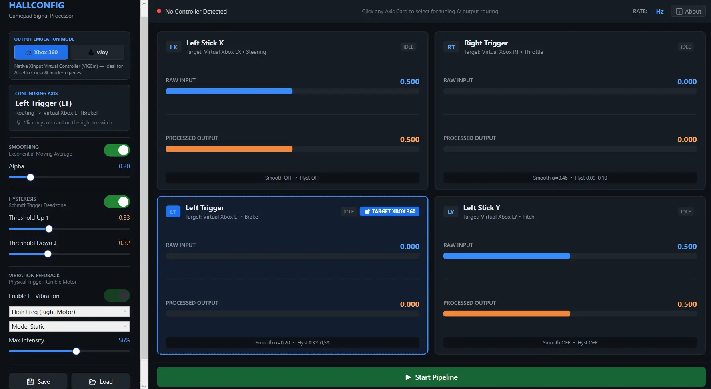
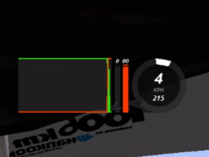
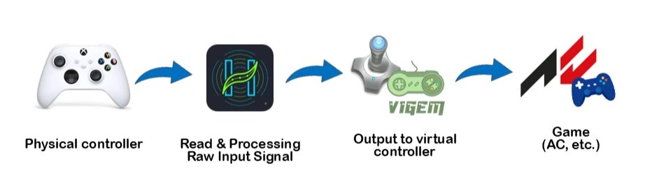

# HallConfig

ID | [EN](/README.md)

**Smoother Inputs. Cleaner Trailbraking.**

Aplikasi desktop Windows buat memperhalus sinyal trigger/stick gamepad hall-effect yang suka stutter/jitter di rentang input rendah (deadzone hardware), sebelum masuk ke game — dibuat khusus buat trailbraking yang mulus di sim racing (Assetto Corsa).

## Ini Apa?

Beberapa controller dengan trigger hall-effect punya deadzone (area buta) yang nggak stabil di rentang tekanan rendah (misal 0–20%), jadi input-nya kedip-kedip pas trailbraking. HallConfig baca sinyal mentah dari controller fisik, dibersihin, terus dikirim ke game lewat controller virtual — nggak perlu ganti hardware.

## Cara Kerjanya (Singkat)

Tombol, D-pad, dan Right Stick diteruskan langsung apa adanya (*passthrough*) — nggak diproses. Yang diproses cuma axis yang emang butuh (trigger & left stick).

## Fitur-Fitur Utama

- **Vibration Feedback** — dukungan motor getar independen (RT/LT) langsung ke controller fisik tanpa delay, terisolasi 100% dari efek getar asli bawaan game. Mendukung profil Proportional dan Static.
- **Dual output mode** — bisa output sebagai vJoy device atau virtual Xbox 360 controller (ViGEm). Xbox 360 lebih disaranin, soalnya kurva sensitivitas yang dibaca game terasa lebih natural dibanding vJoy.
- **Config independen per axis** — Right Trigger, Left Trigger, Left Stick X/Y masing-masing punya setting smoothing & hysteresis sendiri-sendiri.
- **Live monitoring** — ada grafik real-time raw vs output langsung di aplikasi pas lagi tuning.
- **Save/Load preset** — simpan config ke file, tinggal load lagi kapan aja butuh.

## Setup

### 1. Install driver output (pilih satu, sesuai mode yang mau dipakai)

- **Xbox 360 (ViGEm)** — *disaranin*. Install **ViGEmBus** dari [github.com/ViGEm/ViGEmBus/releases](https://github.com/ViGEm/ViGEmBus/releases).
- **vJoy** — install dari [sourceforge.net/projects/vjoystick](https://sourceforge.net/projects/vjoystick/), terus buka `vJoyConf` dan pastiin minimal 1 device aktif.

### 2. Install HallConfig

Download installer terbaru dari [Releases](https://github.com/yeftakun/hall-config/releases), jalanin, ikutin aja wizard-nya.

### 3. (Opsional, tapi disaranin) Install HidHide

Biar controller fisik nggak ikut kebaca game bareng controller virtual — jadi nggak salah bind axis pas main.

1. Download dari [github.com/nefarius/HidHide/releases](https://github.com/nefarius/HidHide/releases), install.
2. Buka **HidHide Configuration Client**:
   - Tab **Applications** → tambahin `HallConfig.App.exe`.
   - Tab **Devices** → centang controller fisik kamu, terus centang **Enable device hiding** di bawah.
3. Cabut-pasang lagi controller fisiknya biar perubahannya kepakai.

## Cara Pakai

Buka HallConfig, pilih **Axis Source** (RT/LT/LX/LY) yang mau di-tuning, terus atur:

| Bagian | Ket |
|---|---|
| **Smoothing (α / alpha)** | Ngeredam noise di sinyal mentah pakai rata-rata bergerak. Alpha makin gede, makin responsif tapi kurang halus; alpha makin kecil, makin halus tapi ada sedikit delay. |
| **Hysteresis** | Mekanisme deadzone dengan dua ambang batas beda buat naik (`Threshold Up`) dan turun (`Threshold Down`) — biar sinyal nggak "ngeblip" bolak-balik pas nilainya lagi pas-pasan di sekitar titik deadzone. |
| **Threshold Up** | Nilai mentah harus lewat ini dulu baru output mulai dianggap "aktif" (di atas 0). |
| **Threshold Down** | Nilai mentah harus turun di bawah ini baru output balik ke 0. Selalu lebih kecil dari Threshold Up. |
| **Output Mode** | Sinyal hasil olahan mau dikirim ke mana: **Xbox 360 (ViGEm)** atau **vJoy**. |
| **Start/Stop Pipeline** | Nyala/matiin proses baca-olah-tulis. Controller virtual cuma muncul selama pipeline-nya jalan. |
| **Rate** | Kecepatan loop pemrosesan (target ~250Hz) — ini indikator kesehatan performa pipeline, bukan performa render UI. |

Toggle smoothing/hysteresis bisa dimatiin sendiri-sendiri per axis, jadi bisa A/B testing feel-nya langsung di game.

## Requirements

Windows 10/11, controller yang kompatibel XInput (Xbox 360/One/generic).

## Known Limitation

Tanpa HidHide, controller fisik dan virtual bakal sama-sama kebaca game bersamaan (nggak bentrok kok, tapi bisa salah pilih pas bind axis) — cek bagian [Setup](#2-opsional-tapi-disaranin-install-hidhide) di atas.

MIT — lihat [LICENSE](LICENSE).

---

*made by Yefta Asyel*